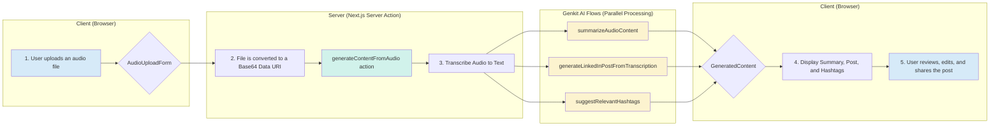

# LinkScribe: AI-Powered Audio to LinkedIn Posts

LinkScribe is a web application that transforms your audio recordings—like meeting snippets, voice notes, or presentation clips—into polished, ready-to-publish LinkedIn posts. Using the power of generative AI, it automatically transcribes your audio, summarizes the key points, and drafts a compelling post complete with relevant hashtags.

This tool is perfect for busy professionals, content creators, and marketers who want to maintain an active LinkedIn presence without spending hours on content creation.


## ✨ Features

-   **Seamless Audio Upload**: Upload common audio formats like `.mp3`, `.wav`, or `.m4a` directly through the web interface.
-   **AI-Powered Transcription**: Converts your spoken words into text with high accuracy.
-   **Automated Content Generation**:
    -   **Key Points Summary**: Get a concise, bulleted list of the main topics discussed in your audio.
    -   **LinkedIn PostDraft**: An AI-crafted post that captures the essence of your content, tailored for a professional audience.
    -   **Hashtag Suggestions**: A list of relevant hashtags to increase your post's visibility.
-   **Interactive Review & Refinement**:
    -   Easily switch between the AI-generated summary and the full transcription.
    -   Edit the post content and hashtags directly in the composer.
-   **Easy Sharing**:
    -   Copy the final post to your clipboard with a single click.
    -   A direct link to open the LinkedIn feed to share your new post.
    -   A demo "Schedule Post" feature to simulate future publishing.

## ⚙️ How It Works: The Technology Stack

LinkScribe is built on a modern, AI-first technology stack:

-   **Frontend**: Built with **Next.js (App Router)**, **React**, and **TypeScript** for a fast, modern, and type-safe user experience.
-   **Styling**: Styled with **Tailwind CSS** and **ShadCN/UI** for a clean, responsive, and aesthetically pleasing design.
-   **Generative AI**: Powered by **Genkit** and **Google's Gemini models** to handle all AI-related tasks, from transcription to content generation.
-   **Server Logic**: Utilizes **Next.js Server Actions** to securely connect the frontend to the backend AI flows.

### Workflow Diagram

The content generation process follows a simple yet powerful flow. The client sends an audio file, and the server orchestrates a series of parallel AI tasks to generate all the necessary content efficiently.



## 📂 Project Structure

The project is organized to separate concerns, making it easy to maintain and scale.

```
.
├── src/
│   ├── app/
│   │   ├── page.tsx          # The main page component for the application.
│   │   ├── layout.tsx        # The root layout for the application.
│   │   └── actions.ts        # Server Actions that orchestrate AI flows.
│   │
│   ├── ai/
│   │   ├── flows/            # Contains all Genkit AI flows.
│   │   │   ├── transcribe-audio-to-text.ts
│   │   │   ├── summarize-audio-content.ts
│   │   │   ├── generate-linkedin-post-from-transcription.ts
│   │   │   └── suggest-relevant-hashtags.ts
│   │   │
│   │   └── genkit.ts         # Genkit plugin and model configuration.
│   │
│   ├── components/
│   │   ├── ui/               # Reusable UI components from ShadCN.
│   │   ├── audio-upload-form.tsx # The form for uploading audio.
│   │   ├── post-preview.tsx    # The component for reviewing generated content.
│   │   └── layout/             # Layout components like the header.
│   │
│   └── lib/
│       ├── utils.ts          # Utility functions.
│       └── placeholder-images.ts # Placeholder image data.
│
├── public/                   # Static assets.
│
└── package.json              # Project dependencies and scripts.
```

## 🚀 Getting Started

To run this project locally, you will need Node.js and an environment configured to use Google's AI models.

1.  **Install Dependencies**:
    ```bash
    npm install
    ```

2.  **Set Up Environment Variables**:
    Create a `.env.local` file in the project root and add your Google AI API key:
    ```
    GEMINI_API_KEY=your_google_ai_api_key
    ```

3.  **Run the Development Server**:
    The application requires two processes to run concurrently: the Next.js frontend and the Genkit AI flows.

    -   **Start the Next.js app**:
        ```bash
        npm run dev
        ```

    -   **Start the Genkit development server** (in a separate terminal):
        ```bash
        npm run genkit:watch
        ```

4.  **Open the Application**:
    Navigate to `http://localhost:9002` in your browser to start using LinkScribe.
